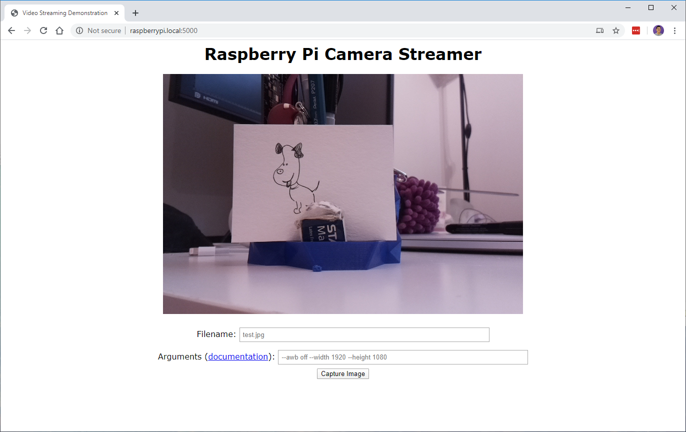

# Simple Raspberry Pi Camera Webserver

Simple Flask-based webserver to show the camera video stream and enable image capture.

**Why:** When a Raspberry Pi is setup in headless mode, it's troublesome to view the camera stream and take pictures through an SSH session. Using this webserver, you can view the camera stream through your web browser. When an image is captured, it's served to the client's browser and can then easily be saved to the client's desktop.



## Getting Started

Install requirements:

```bash
# For the Pi
pip install -r requirements.txt

# For local testing
pip install -r requirements-opencv.txt
```

If not running on a Pi, you can export the following to use your webcam (via OpenCV):

```bash
export CAMERA=opencv
export OPENCV_CAMERA_SOURCE=0 # optional
```

## Usage

Run the app:

```bash
cd app/
python3 app.py
```

Open a browser and navigate to your Pi's address, i.e. `raspberrypi.local:5000`. Or if running locally, navigate to `localhost:5000`.

The text input boxes are fed into the `raspistill` command as arguments like so:

```bash
raspistill --no-preview -t 1 -o test.jpg --awb off --width 1920 --height 1080
```

## Acknowledgements

Thanks to Miguel Grinberg for doing all the legwork in implementing the streaming functionality ([original](http://blog.miguelgrinberg.com/post/video-streaming-with-flask) and its [follow-up](http://blog.miguelgrinberg.com/post/flask-video-streaming-revisited) post).
